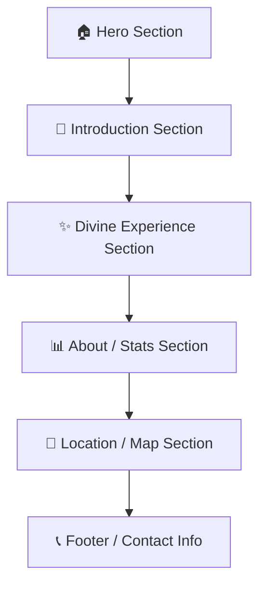
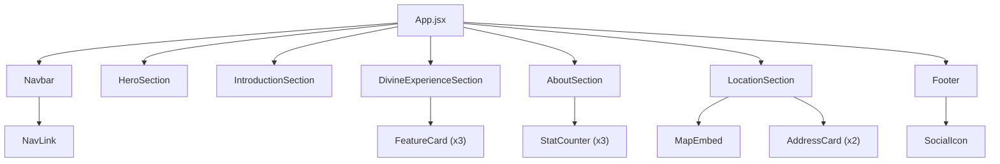

# 🙏 Satlok Ashram Betul — Spiritual Organization Landing Website

## Project Planning Document

---

## 1. Project Overview

**Project Name:** Satlok Ashram Betul — Official Landing Website  
**Project Type:** Spiritual Organization Landing Page (Single Page Application)  
**Purpose:** Satlok Ashram Betul के लिए एक modern, premium और visually stunning landing website बनाना जो visitors को ashram के बारे में जानकारी दे, spiritual services highlight करे, और contact/location details provide करे।

### Goals
- Ashram की online presence establish करना
- Visitors को ashram की activities और services के बारे में inform करना
- Location और contact information accessible बनाना
- Spiritual और peaceful user experience create करना
- Mobile-first responsive design implement करना

---

## 2. Tech Stack

| Layer | Technology | Purpose |
|-------|-----------|---------|
| **Frontend** | React.js (Vite) | UI rendering & SPA |
| **Styling** | Vanilla CSS (Custom Design System) | Premium styling |
| **Icons** | React Icons / Lucide Icons | UI icons |
| **Animations** | CSS Animations + Intersection Observer API | Scroll animations & micro-interactions |
| **Maps** | Google Maps Embed / Leaflet.js | Location map |
| **Fonts** | Google Fonts (Poppins + Playfair Display) | Typography |
| **Deployment** | Vercel / Netlify | Hosting |

> [!NOTE]
> यह एक static landing page है, इसलिए backend (MongoDB, Express, Node.js) की अभी जरूरत नहीं है। भविष्य में अगर contact form, event booking, या admin panel add करना हो तो MERN stack use होगा।

---

## 3. Reference Design Analysis

Reference screenshot से identified sections:



---

## 4. Detailed Section Breakdown

### 4.1 🏠 Hero Section (Welcome Banner)

**Design:**
- Full-width hero banner with ashram की background image (blurred/overlay)
- Gradient overlay (purple-to-transparent)
- Bold heading: **"Welcome to Satlok Ashram Betul"**
- Subtle tagline/description text
- Smooth fade-in animation on page load

**Elements:**
| Element | Description |
|---------|-------------|
| Background Image | Ashram temple/premises photo with purple gradient overlay |
| Heading (H1) | "Welcome to Satlok Ashram Betul" — large, bold, white text |
| Subtitle | Brief spiritual welcome message |
| Scroll indicator | Animated down-arrow to guide user |

**CSS Effects:**
- `background: linear-gradient(135deg, rgba(128, 0, 255, 0.6), rgba(200, 100, 255, 0.3))` overlay
- `animation: fadeInUp 1s ease-out` on text elements
- Parallax scroll effect on background image

---

### 4.2 📖 Introduction Section

**Design:**
- Clean white/light background
- Ashram की feature image (rounded corners, subtle shadow)
- Heading: **"Satlok Ashram Betul"**
- Description paragraph about the ashram
- Two CTA buttons side by side

**Elements:**
| Element | Description |
|---------|-------------|
| Image | Ashram photo (rounded, shadow) |
| Heading (H2) | "Satlok Ashram Betul" |
| Description | 2-3 lines about the ashram's mission and purpose |
| CTA Button 1 | "Explore More" — Primary (filled purple) |
| CTA Button 2 | "Watch Video" — Secondary (outlined) |

**Interactions:**
- Image hover: subtle zoom effect (`transform: scale(1.05)`)
- Buttons: hover glow effect with smooth transition
- Scroll-triggered fade-in animation

---

### 4.3 ✨ Divine Experience Section

**Design:**
- Light gradient background
- Section heading: **"Divine Experience"**
- 3 feature cards in vertical layout (mobile) / horizontal (desktop)
- Each card with icon, title, and brief description

**Feature Cards:**

| Card | Icon | Title | Description |
|------|------|-------|-------------|
| Card 1 | 🧘 Yoga icon | **Yoga/Meditation** | Daily yoga and meditation sessions |
| Card 2 | 🌿 Nature icon | **Peaceful Environment** | Serene and spiritual atmosphere |
| Card 3 | 🕊️ Freedom icon | **Heavenly Freedom** | Path to spiritual liberation |

**Card Design:**
```
┌─────────────────────────┐
│      🧘 (Icon)          │
│                         │
│   Yoga/Meditation       │
│                         │
│  Brief description of   │
│  the service offered    │
└─────────────────────────┘
```

**CSS Effects:**
- Cards: `backdrop-filter: blur(10px)` (glassmorphism)
- Hover: card lifts up (`translateY(-8px)`) with enhanced shadow
- Staggered scroll animation for each card
- Icon: subtle floating animation

---

### 4.4 📊 About / Stats Section

**Design:**
- Purple/violet gradient background (vibrant, eye-catching)
- Section heading: **"About Satlok Ashram"**
- Brief description paragraph
- Counter stats in grid layout
- White text on dark purple background

**Stats Counters:**

| Stat | Value | Label |
|------|-------|-------|
| Counter 1 | **114+** | Visitors/Devotees |
| Counter 2 | **24/7** | Satsang Available |
| Counter 3 | **190+** | Events Conducted |

**CSS Effects:**
- Gradient background: `linear-gradient(135deg, #7B2FBE, #A855F7, #C084FC)`
- Counter numbers: animated count-up effect on scroll (Intersection Observer)
- Smooth `fadeInUp` animation for content
- Subtle floating shapes in background for depth

---

### 4.5 📍 Location / Map Section

**Design:**
- Section heading: **"Connect With Us"**
- Embedded Google Map showing Satlok Ashram Betul location
- Address card overlaid on or below the map
- Contact details listed

**Elements:**
| Element | Description |
|---------|-------------|
| Heading | "Connect With Us" |
| Map | Google Maps embed (interactive) |
| Address Card 1 | **SATLOK ASHRAM** — Full address with icon |
| Address Card 2 | Additional branch/contact address |
| Phone/Email | Contact numbers and email |

**Map Styling:**
- Rounded corners with shadow
- Custom map marker (if using Leaflet)
- Address cards with purple accent border

---

### 4.6 📞 Footer

**Design:**
- Dark background (deep purple/charcoal)
- Quick links
- Social media icons
- Copyright text
- Back-to-top button

**Elements:**
| Element | Description |
|---------|-------------|
| Logo | Ashram name/logo |
| Quick Links | Home, About, Services, Contact |
| Social Media | YouTube, Facebook, Instagram, Twitter icons |
| Copyright | "© 2026 Satlok Ashram Betul. All Rights Reserved." |

---

## 5. Component Architecture



### Components List

| Component | File | Props | Description |
|-----------|------|-------|-------------|
| `Navbar` | `Navbar.jsx` | — | Fixed navigation bar with hamburger menu (mobile) |
| `HeroSection` | `HeroSection.jsx` | `title, subtitle, bgImage` | Full-screen welcome banner |
| `IntroductionSection` | `IntroductionSection.jsx` | `image, heading, description` | Ashram introduction with CTAs |
| `DivineExperienceSection` | `DivineExperienceSection.jsx` | `features[]` | Services/features grid |
| `FeatureCard` | `FeatureCard.jsx` | `icon, title, description` | Individual feature card |
| `AboutSection` | `AboutSection.jsx` | `stats[], description` | About with animated counters |
| `StatCounter` | `StatCounter.jsx` | `value, label, suffix` | Animated number counter |
| `LocationSection` | `LocationSection.jsx` | `mapUrl, addresses[]` | Map and address info |
| `AddressCard` | `AddressCard.jsx` | `name, address, icon` | Single address card |
| `MapEmbed` | `MapEmbed.jsx` | `lat, lng, zoom` | Google Maps embed |
| `Footer` | `Footer.jsx` | `links[], socials[]` | Site footer |
| `SocialIcon` | `SocialIcon.jsx` | `platform, url` | Social media icon link |

---

## 6. Design System

### 6.1 Color Palette

| Token | Hex | Usage |
|-------|-----|-------|
| `--primary` | `#7B2FBE` | Primary purple — buttons, accents |
| `--primary-light` | `#A855F7` | Lighter purple — hover states, gradients |
| `--primary-dark` | `#5B1F8E` | Darker purple — active states |
| `--accent` | `#C084FC` | Soft purple — cards, highlights |
| `--bg-light` | `#FAF5FF` | Light purple tint — section backgrounds |
| `--bg-white` | `#FFFFFF` | White — clean sections |
| `--bg-dark` | `#1A0A2E` | Deep purple — footer, dark sections |
| `--text-primary` | `#1F1F1F` | Dark text — headings |
| `--text-secondary` | `#6B7280` | Gray text — descriptions |
| `--text-white` | `#FFFFFF` | White text — on dark backgrounds |
| `--gradient-hero` | `linear-gradient(135deg, #7B2FBE, #A855F7)` | Hero overlay |
| `--gradient-about` | `linear-gradient(135deg, #5B1F8E, #7B2FBE, #A855F7)` | About section |
| `--shadow-card` | `0 8px 32px rgba(123, 47, 190, 0.15)` | Card shadows |
| `--shadow-hover` | `0 16px 48px rgba(123, 47, 190, 0.25)` | Hover shadows |

### 6.2 Typography

| Element | Font | Weight | Size (Mobile / Desktop) |
|---------|------|--------|------------------------|
| H1 (Hero) | Playfair Display | 700 | 32px / 56px |
| H2 (Section) | Playfair Display | 600 | 28px / 42px |
| H3 (Card Title) | Poppins | 600 | 18px / 22px |
| Body | Poppins | 400 | 14px / 16px |
| Button | Poppins | 600 | 14px / 16px |
| Caption | Poppins | 400 | 12px / 14px |
| Stat Number | Poppins | 700 | 36px / 48px |

### 6.3 Spacing Scale

```
--space-xs:  4px
--space-sm:  8px
--space-md:  16px
--space-lg:  24px
--space-xl:  32px
--space-2xl: 48px
--space-3xl: 64px
--space-4xl: 96px
```

### 6.4 Border Radius

```
--radius-sm:   8px    (buttons, inputs)
--radius-md:   12px   (cards)
--radius-lg:   16px   (images, containers)
--radius-xl:   24px   (large cards)
--radius-full: 50%    (circular elements)
```

---

## 7. Animations & Micro-Interactions

| Animation | Trigger | Elements | CSS |
|-----------|---------|----------|-----|
| Fade In Up | On scroll (IntersectionObserver) | All sections | `translateY(30px) → translateY(0)` + `opacity: 0 → 1` |
| Staggered Fade | On scroll | Feature cards | Same as above with `animation-delay` stagger |
| Counter Up | On scroll into view | Stat numbers | JS animated count from 0 to target |
| Card Hover Lift | On hover | Feature cards | `translateY(0) → translateY(-8px)` + shadow increase |
| Button Glow | On hover | CTA buttons | `box-shadow` glow animation |
| Icon Float | Continuous | Feature icons | `translateY(0) → translateY(-5px)` loop |
| Parallax | On scroll | Hero background | `background-attachment: fixed` or JS parallax |
| Navbar Blur | On scroll | Navbar | `backdrop-filter: blur(12px)` when scrolled |
| Scroll Progress | On scroll | Top bar | Width increases as page scrolls |
| Image Reveal | On scroll | Intro image | Clip-path or scale reveal animation |

---

## 8. Responsive Design Strategy

### Breakpoints

```css
/* Mobile First Approach */
/* Default styles: Mobile (< 640px) */

@media (min-width: 640px)  { /* Tablet Portrait */ }
@media (min-width: 768px)  { /* Tablet Landscape */ }
@media (min-width: 1024px) { /* Desktop */ }
@media (min-width: 1280px) { /* Large Desktop */ }
```

### Layout Changes

| Section | Mobile (< 768px) | Desktop (≥ 1024px) |
|---------|-------------------|---------------------|
| Navbar | Hamburger menu | Horizontal links |
| Hero | Stacked, smaller text | Full-screen, large text |
| Introduction | Stacked (image → text) | Side by side (image + text) |
| Divine Experience | 1 card per row (vertical) | 3 cards per row (horizontal) |
| About/Stats | 2 stats per row | 3 stats in one row |
| Location/Map | Stacked (map → address) | Side by side |
| Footer | Stacked columns | Multi-column grid |

---

## 9. Folder Structure

```
satlok-ashram-betul/
├── public/
│   ├── favicon.ico
│   ├── og-image.jpg                  # Social media preview image
│   └── images/
│       ├── hero-bg.jpg               # Hero background image
│       ├── ashram-intro.jpg           # Introduction section image
│       ├── ashram-logo.png            # Ashram logo
│       └── icons/
│           ├── yoga.svg
│           ├── peaceful.svg
│           └── freedom.svg
│
├── src/
│   ├── main.jsx                       # Entry point
│   ├── App.jsx                        # Main App component
│   ├── App.css                        # Global styles
│   ├── index.css                      # CSS Reset + Design tokens
│   │
│   ├── components/
│   │   ├── Navbar/
│   │   │   ├── Navbar.jsx
│   │   │   └── Navbar.css
│   │   │
│   │   ├── HeroSection/
│   │   │   ├── HeroSection.jsx
│   │   │   └── HeroSection.css
│   │   │
│   │   ├── IntroductionSection/
│   │   │   ├── IntroductionSection.jsx
│   │   │   └── IntroductionSection.css
│   │   │
│   │   ├── DivineExperienceSection/
│   │   │   ├── DivineExperienceSection.jsx
│   │   │   ├── DivineExperienceSection.css
│   │   │   └── FeatureCard.jsx
│   │   │
│   │   ├── AboutSection/
│   │   │   ├── AboutSection.jsx
│   │   │   ├── AboutSection.css
│   │   │   └── StatCounter.jsx
│   │   │
│   │   ├── LocationSection/
│   │   │   ├── LocationSection.jsx
│   │   │   ├── LocationSection.css
│   │   │   ├── MapEmbed.jsx
│   │   │   └── AddressCard.jsx
│   │   │
│   │   └── Footer/
│   │       ├── Footer.jsx
│   │       └── Footer.css
│   │
│   ├── hooks/
│   │   ├── useScrollAnimation.js      # Intersection Observer hook
│   │   └── useCountUp.js              # Counter animation hook
│   │
│   ├── data/
│   │   └── siteData.js                # All static content (text, stats, addresses)
│   │
│   └── utils/
│       └── constants.js               # Constants and config
│
├── index.html
├── package.json
├── vite.config.js
├── project.md
└── README.md
```

---

## 10. Implementation Phases

### Phase 1: Project Setup & Design Foundation (Day 1)
- [ ] Vite + React project initialize करना
- [ ] Design system setup (CSS variables, fonts, reset)
- [ ] Folder structure create करना
- [ ] Google Fonts (Poppins + Playfair Display) integrate करना
- [ ] Base layout component setup

### Phase 2: Core Sections Development (Day 2-3)
- [ ] **Navbar** — Responsive navigation with hamburger menu
- [ ] **Hero Section** — Full-screen banner with gradient overlay
- [ ] **Introduction Section** — Image + text + CTA buttons
- [ ] **Divine Experience Section** — Feature cards with icons
- [ ] **About Section** — Stats counters with animated numbers
- [ ] **Location Section** — Google Maps embed + address cards
- [ ] **Footer** — Links, social icons, copyright

### Phase 3: Animations & Interactions (Day 4)
- [ ] Scroll-triggered animations (Intersection Observer)
- [ ] Counter-up animation for stats
- [ ] Hover effects (cards, buttons)
- [ ] Parallax effect on hero
- [ ] Navbar scroll behavior (blur + shadow)
- [ ] Smooth scroll for navigation links

### Phase 4: Responsive Design & Polish (Day 5)
- [ ] Mobile layout refinements
- [ ] Tablet breakpoint testing
- [ ] Desktop layout optimization
- [ ] Cross-browser testing
- [ ] Performance optimization (image compression, lazy loading)

### Phase 5: SEO & Deployment (Day 6)
- [ ] Meta tags, Open Graph, structured data
- [ ] Favicon and social preview image
- [ ] Lighthouse audit (Performance, Accessibility, SEO)
- [ ] Deploy to Vercel/Netlify
- [ ] Custom domain setup (if available)

---

## 11. SEO Strategy

### Meta Tags
```html
<title>Satlok Ashram Betul — Spiritual Retreat & Meditation Center</title>
<meta name="description" content="Satlok Ashram Betul is a spiritual retreat center offering yoga, meditation, satsang, and peaceful environment for seekers of truth and spiritual liberation.">
<meta name="keywords" content="Satlok Ashram, Betul, Spiritual, Meditation, Yoga, Satsang, Ashram, Sant Rampal Ji">
```

### Open Graph
```html
<meta property="og:title" content="Satlok Ashram Betul">
<meta property="og:description" content="Experience divine peace at Satlok Ashram Betul">
<meta property="og:image" content="/og-image.jpg">
<meta property="og:type" content="website">
```

### Structured Data (JSON-LD)
```json
{
  "@context": "https://schema.org",
  "@type": "ReligiousOrganization",
  "name": "Satlok Ashram Betul",
  "address": {
    "@type": "PostalAddress",
    "addressLocality": "Betul",
    "addressRegion": "Madhya Pradesh",
    "addressCountry": "IN"
  }
}
```

---

## 12. Performance Targets

| Metric | Target |
|--------|--------|
| Lighthouse Performance | > 90 |
| Lighthouse Accessibility | > 95 |
| Lighthouse SEO | > 95 |
| First Contentful Paint (FCP) | < 1.5s |
| Largest Contentful Paint (LCP) | < 2.5s |
| Cumulative Layout Shift (CLS) | < 0.1 |
| Total Bundle Size | < 500KB (gzipped) |

---

## 13. Assets Required

| Asset | Type | Source | Status |
|-------|------|--------|--------|
| Hero Background Image | JPG/WebP | Ashram premises photo or AI generated | ⏳ Pending |
| Introduction Image | JPG/WebP | Ashram photo or AI generated | ⏳ Pending |
| Ashram Logo | PNG/SVG | Design or existing logo | ⏳ Pending |
| Feature Icons (3) | SVG | React Icons / Custom SVGs | ⏳ Pending |
| Social Media Icons | SVG | React Icons library | ✅ Available |
| Favicon | ICO/PNG | From logo | ⏳ Pending |
| OG Preview Image | JPG | Design from hero section | ⏳ Pending |

---

## User Review Required

> [!IMPORTANT]
> **Content & Images:** क्या ashram की real photos available हैं या AI generated images use करनी होंगी?

> [!IMPORTANT]
> **Language:** Website content Hindi में होगा, English में, या bilingual (दोनों)?

> [!IMPORTANT]
> **Map Location:** Satlok Ashram Betul का exact Google Maps location/coordinates confirm करें।

## Open Questions

> [!NOTE]
> 1. **Backend जरूरत:** क्या अभी सिर्फ static landing page बनानी है या contact form भी working चाहिए (email integration)?
> 2. **Additional Pages:** क्या future में Events, Gallery, Satsang Schedule जैसे pages add करने हैं?
> 3. **Domain:** क्या कोई custom domain purchase किया है (e.g., satlokashrambetul.com)?
> 4. **Social Media Links:** Ashram के official social media accounts के URLs क्या हैं?
> 5. **Color Theme:** Reference में purple/violet theme है — क्या यही final color scheme रखनी है या कोई और preference है?

---

## Verification Plan

### Automated Tests
- Lighthouse audit run करना (Performance > 90, SEO > 95)
- Mobile responsive testing via Chrome DevTools
- Cross-browser testing (Chrome, Safari, Firefox)

### Manual Verification
- सभी sections visually reference design से match होने चाहिए
- All animations smooth चलनी चाहिए (60fps)
- Google Map correctly load हो और location सही दिखे
- All links और buttons functional हों
- Mobile, tablet, और desktop पर layout test करना

---

*Document Created: 23 May 2026*  
*Last Updated: 23 May 2026*  
*Status: 📋 Planning Phase — Awaiting User Approval*
